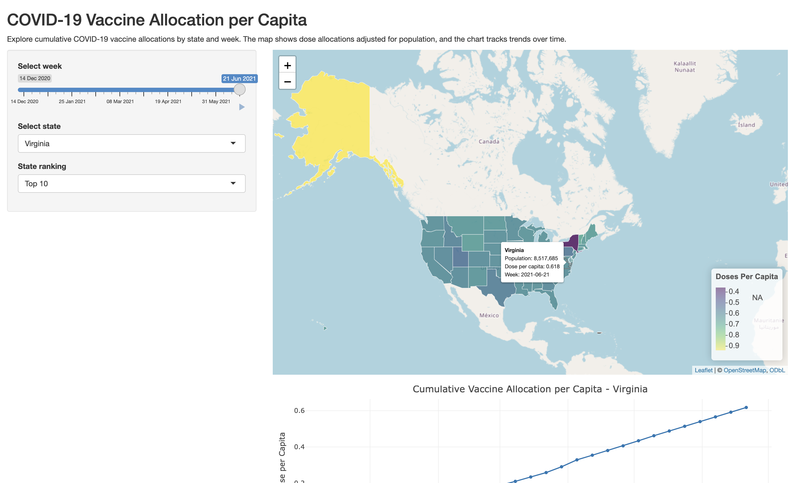

# COVID-19 Vaccine Allocation Shiny App

Interactive dashboard built in R using Shiny to visualize COVID-19 vaccine allocations across U.S. states.

## Features
- Interactive US map (Leaflet)
- Weekly time slider
- State-level time series (Plotly)
- Population-adjusted allocation metrics

## Tech Stack
- R (tidyverse, Shiny)
- Leaflet
- Plotly
- lubridate, janitor

## How to Run
```r
shiny::runApp()

## Preview

